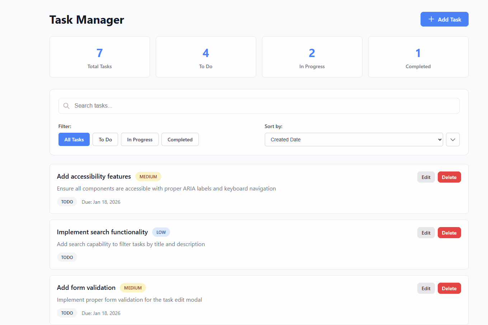

# Task Manager Application

A modern, feature-rich task management application built with Angular 21, featuring reactive state management with signals, comprehensive CRUD operations, and full test coverage.



## 🎯 Features

### Core Functionality
- ✅ **Create Tasks** - Add new tasks with title, description, priority, status, and due date
- ✅ **Read Tasks** - View all tasks with detailed information and visual indicators
- ✅ **Update Tasks** - Edit existing tasks with comprehensive form validation
- ✅ **Delete Tasks** - Remove tasks with confirmation modal for safety
- ✅ **Task Statistics** - Real-time dashboard showing total, todo, in-progress, and completed tasks

### Advanced Features
- 🔍 **Search** - Real-time search across task titles and descriptions
- 🎚️ **Filter** - Filter tasks by status (All, To Do, In Progress, Completed)
- ↕️ **Sort** - Sort by title, due date, priority, status, or created date (ascending/descending)
- ⏰ **Overdue Detection** - Visual indicators for overdue tasks
- ✨ **Responsive Design** - Mobile-friendly interface with adaptive layouts
- ♿ **Accessibility** - ARIA labels, keyboard navigation, and screen reader support
- 🎨 **Modern UI** - Clean, intuitive interface with visual feedback

### Technical Highlights
- 🚀 **Angular 21** with standalone components
- 📊 **Signals-based** reactive state management
- ✅ **152 Unit Tests** with 100% passing rate
- 🧪 **Vitest** for fast, modern testing
- 📝 **Form Validation** with detailed error messages
- 🎭 **Custom Modals** for better UX
- 🔄 **Real-time Updates** with reactive data flow

## 🛠️ Technologies

- **Framework**: Angular 21.0.0
- **Language**: TypeScript 5.9.2
- **Build Tool**: @angular/build with esbuild
- **Testing**: Vitest 4.0.16
- **State Management**: Angular Signals
- **Forms**: Reactive Forms with validation
- **Styling**: Pure CSS with responsive design

## 📦 Installation

### Prerequisites
- Node.js 20.x or higher
- npm 11.6.2 or higher

### Setup

1. **Clone the repository**
   ```bash
   git clone https://github.com/selaaa-online/my-budget.git
   cd task-manager
   ```

2. **Install dependencies**
   ```bash
   npm install
   ```

3. **Run the development server**
   ```bash
   npm start
   ```

4. **Open your browser**
   Navigate to `http://localhost:4200/`

## 🧪 Testing

Run the comprehensive test suite:

```bash
# Run all tests
npm test

# Run tests in watch mode
npm run test:watch

# Run tests with coverage report
npm run test:coverage
```

**Test Coverage**: 152 tests across 6 test files
- TaskService: 28 tests
- ButtonComponent: 23 tests
- ConfirmationModalComponent: 18 tests
- TaskItemComponent: 26 tests
- TaskEditModalComponent: 31 tests
- TaskListComponent: 26 tests

## 🎬 Demo Recording Instructions

To create the demo GIF shown above, follow these steps:

### Recommended Tools
- **Windows**: [ScreenToGif](https://www.screentogif.com/) (Free & Open Source)
- **macOS**: [Kap](https://getkap.co/) (Free & Open Source)
- **Linux**: [Peek](https://github.com/phw/peek) (Free & Open Source)
- **Cross-platform**: [LICEcap](https://www.cockos.com/licecap/) (Free)

### Recording Workflow

1. **Prepare the Application**
   - Run `npm start` to start the dev server
   - Open browser at `http://localhost:4200/`
   - Clear any test data if needed
   - Set browser window to 1280x720 or 1920x1080

2. **Start Recording** and demonstrate:

   **Scene 1: Dashboard Overview** (3 seconds)
   - Show the main page with statistics cards (Total, To Do, In Progress, Completed)
   - Display existing tasks in the list

   **Scene 2: Create Task** (8 seconds)
   - Click "Add Task" button
   - Fill in the form:
     - Title: "Prepare presentation"
     - Description: "Create slides for the quarterly review meeting"
     - Priority: High
     - Status: To Do
     - Due Date: Select tomorrow's date
   - Click "Save Task"
   - Show the new task appearing in the list

   **Scene 3: Search Functionality** (5 seconds)
   - Type "presentation" in the search box
   - Show real-time filtering of tasks
   - Clear search to show all tasks again

   **Scene 4: Filter Tasks** (5 seconds)
   - Click "To Do" filter button
   - Show only incomplete tasks
   - Click "In Progress" filter
   - Click "All" to show everything again

   **Scene 5: Sort Tasks** (5 seconds)
   - Click sort dropdown
   - Select "Priority"
   - Show tasks reorganized by priority
   - Click sort direction toggle (ascending/descending)

   **Scene 6: Edit Task** (8 seconds)
   - Click edit button on a task
   - Change status to "In Progress"
   - Update description
   - Click "Save Task"
   - Show task card updated with new badge color

   **Scene 7: Delete Task** (5 seconds)
   - Click delete button on a task
   - Show confirmation modal appearing
   - Click "Yes, Delete" button
   - Show task removed from list and statistics updated

   **Scene 8: Responsive Design** (3 seconds)
   - Resize browser window from desktop to mobile width
   - Show responsive layout adaptation

3. **Stop Recording**

### Recording Settings
- **Resolution**: 1280x720 (recommended) or 1920x1080
- **Frame Rate**: 15-20 FPS (keeps file size manageable)
- **Duration**: 40-60 seconds total
- **Target File Size**: Under 10MB

### GIF Optimization

After recording, optimize the GIF for web:

**Using ScreenToGif (Windows)**:
1. Click "Editor" after recording
2. Delete unnecessary frames
3. Go to File > Save As > Gif
4. Set encoder to "FFmpeg"
5. Reduce colors to 128-256 if needed
6. Save as `demo.gif` in project root

**Using Online Tools**:
- [ezgif.com](https://ezgif.com/optimize) - Optimize existing GIF
- [gifcompressor.com](https://gifcompressor.com/) - Compress GIF files

**Using Command Line** (optional):
```bash
# Install gifsicle
# Windows: choco install gifsicle
# macOS: brew install gifsicle
# Linux: sudo apt install gifsicle

# Optimize
gifsicle -O3 --lossy=80 --colors 256 -o demo.gif demo-raw.gif
```

### Alternative: Create MP4 Video

If the GIF is too large, create an MP4 instead:

```bash
# Using ffmpeg (converts GIF to MP4)
ffmpeg -i demo.gif -movflags faststart -pix_fmt yuv420p -vf "scale=trunc(iw/2)*2:trunc(ih/2)*2" demo.mp4
```

Update README to reference `demo.mp4` instead.

## 📁 Project Structure

```
task-manager/
├── src/
│   ├── app/
│   │   ├── components/          # Reusable UI components
│   │   │   ├── button/          # Customizable button component
│   │   │   ├── confirmation-modal/  # Delete confirmation dialog
│   │   │   ├── modal/           # Reusable modal wrapper
│   │   │   ├── search-input/    # Search input with icon
│   │   │   └── task-item/       # Task card component
│   │   ├── models/              # TypeScript interfaces
│   │   │   └── task.model.ts    # Task, enums, types
│   │   ├── pages/               # Feature components
│   │   │   ├── task-edit-modal/ # Add/edit task form
│   │   │   └── task-list/       # Main task list page
│   │   ├── services/            # Business logic
│   │   │   └── task.service.ts  # Task CRUD & state
│   │   ├── app.ts               # Root component
│   │   ├── app.config.ts        # App configuration
│   │   └── app.routes.ts        # Routing configuration
│   ├── index.html               # Entry HTML
│   ├── main.ts                  # Application bootstrap
│   ├── styles.css               # Global styles
│   └── test-setup.ts            # Test configuration
├── angular.json                 # Angular CLI configuration
├── package.json                 # Dependencies & scripts
├── tsconfig.json                # TypeScript configuration
├── vitest.config.ts             # Vitest configuration
└── README.md                    # This file
```

## 🎨 UI Components

### TaskListComponent
Main page displaying:
- **Statistics Dashboard**: Shows total, to-do, in-progress, and completed task counts
- **Search Bar**: Real-time search across titles and descriptions
- **Filter Buttons**: Quick filters for All, To Do, In Progress, Completed
- **Sort Controls**: Dropdown with 5 sort options and direction toggle
- **Task List**: Grid of task cards with responsive layout
- **Empty State**: Friendly message when no tasks match filters

### TaskEditModalComponent
Modal form with:
- **Title Input**: 3-100 characters, required
- **Description Textarea**: 10-500 characters, required
- **Status Dropdown**: To Do, In Progress, Completed
- **Priority Dropdown**: Low, Medium, High
- **Due Date Picker**: Optional date selection
- **Validation**: Real-time error messages below each field
- **Actions**: Save and Cancel buttons

### TaskItemComponent
Task card showing:
- **Title & Description**: Primary task information
- **Priority Badge**: Color-coded (Red=High, Yellow=Medium, Green=Low)
- **Status Badge**: Current task state with color
- **Due Date**: Formatted date with overdue warning (red text)
- **Action Buttons**: Edit (blue) and Delete (red) buttons
- **Hover Effects**: Subtle shadow and scale on hover

### ConfirmationModalComponent
Safety modal for destructive actions:
- **Warning Icon**: Visual indicator of destructive action
- **Title**: "Confirm Deletion"
- **Message**: Dynamic message with task title
- **Actions**: Cancel (gray) and Yes, Delete (red) buttons
- **Overlay**: Click outside to cancel

## 🔧 Scripts

```bash
# Development
npm start              # Start dev server on localhost:4200
npm run build          # Build for production in dist/
npm run watch          # Build in watch mode

# Testing
npm test               # Run all tests once
npm run test:watch     # Run tests in watch mode
npm run test:coverage  # Generate coverage report
```

## 📊 Data Models

### Task Interface
```typescript
interface Task {
  id: string;           // UUID
  title: string;        // 3-100 characters
  description: string;  // 10-500 characters
  status: TaskStatus;   // TODO | IN_PROGRESS | COMPLETED
  priority: TaskPriority; // LOW | MEDIUM | HIGH
  dueDate: Date | null; // Optional due date
  createdAt: Date;      // Auto-generated
  updatedAt: Date;      // Auto-updated
}
```

### Task Status Enum
- `TODO` - Task not started
- `IN_PROGRESS` - Currently being worked on
- `COMPLETED` - Task finished

### Task Priority Enum
- `LOW` - Minor importance
- `MEDIUM` - Normal importance
- `HIGH` - Critical importance

## 🎯 Feature Details

### 🔍 Search
- **Real-time**: Results update as you type
- **Case-insensitive**: Finds matches regardless of case
- **Multi-field**: Searches both title and description
- **Instant**: No delay, no search button needed

### 🎚️ Filter
- **All Tasks**: Default view showing everything
- **To Do**: Only tasks with TODO status
- **In Progress**: Only tasks being actively worked on
- **Completed**: Only finished tasks
- **Visual Feedback**: Active filter button highlighted

### ↕️ Sort
Available sort criteria:
1. **Title**: Alphabetical (A-Z or Z-A)
2. **Due Date**: Earliest to latest or vice versa
3. **Priority**: High to Low or Low to High
4. **Status**: TODO → IN_PROGRESS → COMPLETED
5. **Created Date**: Newest first or oldest first

**Sort Direction**: Toggle between ascending ↑ and descending ↓

### 📝 Validation Rules

**Title Field**:
- ✅ Required
- ✅ Minimum 3 characters
- ✅ Maximum 100 characters
- ❌ "Title is required"
- ❌ "Title must be at least 3 characters"
- ❌ "Title cannot exceed 100 characters"

**Description Field**:
- ✅ Required
- ✅ Minimum 10 characters
- ✅ Maximum 500 characters
- ❌ "Description is required"
- ❌ "Description must be at least 10 characters"
- ❌ "Description cannot exceed 500 characters"

**Other Fields**:
- Status: Required (dropdown)
- Priority: Required (dropdown)
- Due Date: Optional (date picker)

### 📱 Responsive Design

**Desktop (>768px)**:
- Task grid: 2-3 columns
- Full search and filter controls
- Side-by-side action buttons

**Tablet (481px-768px)**:
- Task grid: 2 columns
- Stacked controls
- Comfortable touch targets

**Mobile (<480px)**:
- Task grid: 1 column
- Full-width buttons
- Optimized for touch
- Simplified layout

## 🚀 Getting Started (Quick Start)

```bash
# 1. Clone and install
git clone https://github.com/selaaa-online/my-budget.git
cd task-manager
npm install

# 2. Start development server
npm start

# 3. Run tests
npm test

# 4. Build for production
npm run build
```

The app comes with 7 sample tasks pre-loaded to demonstrate all features.

## 🧪 Testing Details

### Test Framework
- **Vitest 4.0.16** with jsdom environment
- **@analogjs/vite-plugin-angular** for component testing
- **@angular/platform-browser-dynamic** for test environment

### Test Structure
```
src/
├── app/
│   ├── services/
│   │   └── task.service.spec.ts          # 28 tests
│   ├── components/
│   │   ├── button/
│   │   │   └── button.component.spec.ts   # 23 tests
│   │   ├── confirmation-modal/
│   │   │   └── confirmation-modal.component.spec.ts  # 18 tests
│   │   └── task-item/
│   │       └── task-item.component.spec.ts  # 26 tests
│   └── pages/
│       ├── task-edit-modal/
│       │   └── task-edit-modal.component.spec.ts  # 31 tests
│       └── task-list/
│           └── task-list.component.spec.ts  # 26 tests
```

### Test Coverage Areas
- ✅ CRUD operations
- ✅ Search functionality
- ✅ Filter operations
- ✅ Sort functionality
- ✅ Form validation
- ✅ Modal interactions
- ✅ Event emissions
- ✅ Edge cases
- ✅ Error states

### Running Tests

```bash
# Run once
npm test

# Watch mode (auto-rerun on changes)
npm run test:watch

# With coverage report
npm run test:coverage
```

Expected output:
```
✓ src/app/services/task.service.spec.ts (28)
✓ src/app/components/button/button.component.spec.ts (23)
✓ src/app/components/confirmation-modal/confirmation-modal.component.spec.ts (18)
✓ src/app/components/task-item/task-item.component.spec.ts (26)
✓ src/app/pages/task-edit-modal/task-edit-modal.component.spec.ts (31)
✓ src/app/pages/task-list/task-list.component.spec.ts (26)

Test Files  6 passed (6)
Tests  152 passed (152)
```

## 🎨 Color Scheme

### Priority Colors
- **High**: `#dc2626` (Red) - Urgent, attention needed
- **Medium**: `#f59e0b` (Amber) - Normal priority
- **Low**: `#10b981` (Green) - Can wait

### Status Colors
- **To Do**: `#6366f1` (Indigo) - Not started
- **In Progress**: `#f59e0b` (Amber) - Active work
- **Completed**: `#10b981` (Green) - Finished

### UI Colors
- **Primary**: `#4f46e5` (Indigo) - Main actions
- **Danger**: `#dc2626` (Red) - Delete, destructive
- **Success**: `#10b981` (Green) - Confirm, positive
- **Secondary**: `#6b7280` (Gray) - Cancel, neutral

## 🚀 Future Enhancements

### Planned Features
- [ ] **Persistence**: LocalStorage/IndexedDB for offline support
- [ ] **Categories/Tags**: Organize tasks with custom tags
- [ ] **Drag & Drop**: Reorder tasks and change status visually
- [ ] **Task Templates**: Quick-create from predefined templates
- [ ] **Subtasks**: Break down tasks into smaller steps
- [ ] **Task History**: View audit log of changes
- [ ] **Export/Import**: CSV, JSON export capabilities
- [ ] **Dark Mode**: Theme toggle for better accessibility
- [ ] **Notifications**: Browser notifications for due tasks
- [ ] **Attachments**: Add files to tasks

### Technical Improvements
- [ ] **Backend Integration**: REST API with real database
- [ ] **Authentication**: User login and multi-user support
- [ ] **PWA Support**: Install as desktop/mobile app
- [ ] **Real-time Sync**: WebSocket for multi-device sync
- [ ] **E2E Tests**: Playwright/Cypress for end-to-end testing
- [ ] **CI/CD**: Automated testing and deployment
- [ ] **Performance**: Virtual scrolling for large lists
- [ ] **Internationalization**: Multi-language support

## 📝 License

This project is part of a technical assessment and is provided as-is for demonstration purposes.

## 👤 Author

Built with ❤️ using Angular 21 and modern web technologies.

## 🙏 Acknowledgments

- Angular team for the excellent framework and tools
- Vitest team for the fast and modern testing framework
- Open source community for best practices and patterns

---

## 📌 Important Notes

### Creating the Demo GIF

**The demo.gif file is NOT included in the repository.** To create it:

1. Install a screen recording tool (see "Recommended Tools" section above)
2. Follow the "Recording Workflow" step-by-step
3. Save the file as `demo.gif` in the project root directory
4. Optimize the file to keep it under 10MB

### Sample Data

The application includes 7 pre-loaded sample tasks demonstrating:
- Different priorities (High, Medium, Low)
- Different statuses (To Do, In Progress, Completed)
- Tasks with and without due dates
- Overdue tasks for testing notifications

### Browser Compatibility

Tested and working on:
- ✅ Chrome 120+
- ✅ Firefox 121+
- ✅ Edge 120+
- ✅ Safari 17+

### Known Limitations

- Data is stored in memory only (resets on page refresh)
- No user authentication (single user only)
- No backend persistence
- No real-time collaboration features

---

**Ready to get started?** Run `npm start` and open `http://localhost:4200/` to see the app in action! 🚀
